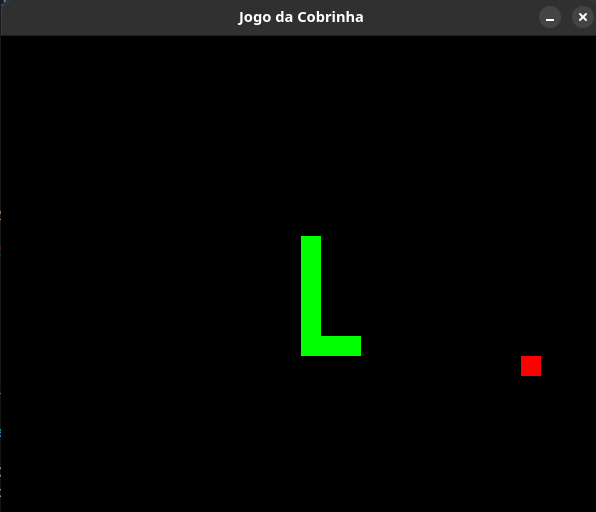
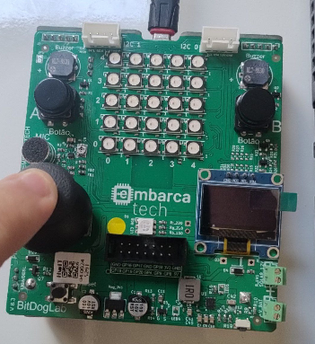

# 🐍 Jogo da Cobrinha com Controle Remoto

Este documento descreve o projeto do jogo da cobrinha com controle remoto, incluindo instruções para gravação na placa BitdogLab, estrutura do projeto, funcionamento do jogo.

Link do repositório: https://github.com/taffarel55/embarcatech

|                      Jogo 🐍                      |           Controle 🕹️            |
| :-----------------------------------------------: | :------------------------------: |
|  |  |

A ideia inicial era utilizar um exemplo simples e mostrar como isso pode ser aplicado em soluções integradas. Devido a limitação de hardware e de componentes eletrônicos adicionais, e também do desejo de NÃO fazer no Wokwi por que eu queria ver um circuito real funcionando, eu utilizei o Joystick integrado à placa BitDogLab junto com a comunicação serial para realizar uma leitura serial no meu computador e utilizar essa informação do sensor em um software, inicialmente pensei em fazer algum tipo de sensoriamento e plotar gráficos, mas seria complicado simular um dado real com o joystick.

Ai foi que eu tive a ideia de criar um jogo da cobrinha e usar a informação do joystick para controlar a direção X e Y da cobrinha :D

https://github.com/user-attachments/assets/9cd406ab-e85b-4a6d-9846-9ef16c740153

## ⚙️ Funcionamento do Jogo

O jogo da cobrinha é controlado por um controle remoto de hardware que envia dados para o computador através da porta serial. O código em C `projeto.c` roda na placa **BitdogLab** e é responsável por ler os valores dos potenciômetros `VRX` e `VRY` conectados aos pinos 26 e 27 (ADC). Esses valores são enviados para o computador via porta serial.

O código em Python `cobrinha.py` é executado no computador e lê os dados da porta serial. Os valores de `VRX` e `VRY` são usados para controlar a direção da cobrinha no jogo. O jogo em si é implementado usando a biblioteca `pygame`.

Controle da cobrinha

- `VRX`: Controla o movimento horizontal da cobrinha (esquerda/direita).
- `VRY`: Controla o movimento vertical da cobrinha (cima/baixo).

## 📌 Instruções para gravação na Placa BitDogLab

### 1. Instale o Pico SDK

Certifique-se de ter o Pico SDK instalado e configurado corretamente.

### 2. Compile o código C

Use o CMake para compilar o código C e gerar o arquivo .uf2.

### 3. Grave o arquivo .uf2

Conecte a placa **BitDogLab** ao computador no modo de bootloader (segurando o botão `BOOTSEL` enquanto conecta). Arraste e solte o arquivo `.uf2` gerado para a unidade de disco que aparece.

Ou só grave usando o _hands-free_!

## 📌 Executando o jogo no computador

### 1. Crie um ambiente virtual:

```bash
python3 -m venv .venv
source .venv/bin/activate  # No Linux/macOS
.venv\Scripts\activate     # No Windows
```

### 2. Instale as dependências:

```bash
pip install -r projeto/jogo/requirements.txt
```

### 3. Execute o jogo:

```
python projeto/jogo/cobrinha.py
```

> ⚠️ **Observação**:
> Certifique-se de que a porta serial correta esteja configurada no código Python.

## ✨ Futuras melhorias

Acredito que 2 coisas podem ser feitas para adicionar novos recursos como a capacidade de comunicação sem fio do controle através do módulo de Wifi e a escolha no game do nível de dificuldade ou até mesmo fazer uma dificuldade progressiva!

Assim o jogo funcionaria como se fosse um controle sem fio e através de uma comunicação duplex, o programa em python poderia enviar um comando para o firmware quando fosse a hora de atualizar a taxa de amostragem para aumentar a velocidade do jogo

## 🤝 Pessoas colaboradoras

Agradecemos às seguintes pessoas que contribuíram para este projeto:

<table>
  <tr>
    <td align="center">
      <a href="https://github.com/taffarel55">
        <br>
        <sub>
          <b>Maurício Taffarel</b>
        </sub>
      </a>
    </td>
    <!--
    <td align="center">
      <a href="#">
        <br>
        <sub>
          <b>Mark Zuckerberg</b>
        </sub>
      </a>
    </td>
    <td align="center">
      <a href="#">
        <br>
        <sub>
          <b>Steve Jobs</b>
        </sub>
      </a>
    </td>
    -->
  </tr>
</table>

## 😄 Seja um das pessoas contribuidoras<br>

Quer fazer parte desse projeto e ajustar alguma ~~merda~~ besteira que eu escrevi? Abre aí uma _issue_ e proponha mudanças!

Ah, fique a vontade para editar este `README.md` te adicionando à lista de pessoas contribuidoras.

## 📝 Licença

Esse projeto está sob licença. Veja o arquivo [LICENÇA](LICENSE) para mais detalhes.

[⬆ Voltar ao topo](#inicio)<br>
