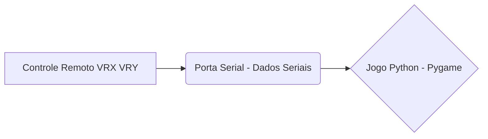
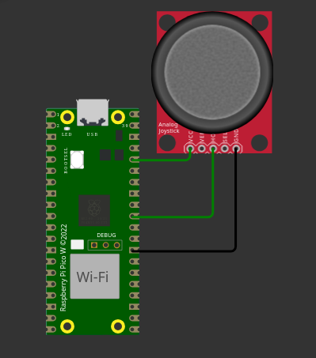

# Relatório do Projeto: Jogo da Cobrinha com Controle Remoto ️


🔗 Link para a documentação menos detalhada (a que ficou no README do GitHub): 

https://github.com/taffarel55/embarcatech


## a) 🎯 Escopo do Projeto

*   **Apresentação do Projeto:** O projeto "Jogo da Cobrinha com Controle Remoto" é uma implementação interativa do clássico jogo da cobrinha, onde o jogador controla a cobrinha através de um controle remoto de hardware. O objetivo do jogo é consumir o máximo de "frutas" possível, fazendo com que a cobrinha cresça, evitando colisões com as bordas do jogo ou com o próprio corpo.
*   **Título do Projeto:** Jogo da Cobrinha com Controle Remoto 
*   **Objetivos do Projeto:**

    *   Desenvolver um jogo da cobrinha funcional e jogável.
    *   Integrar um controle remoto de hardware para controlar a cobrinha.
    *   Implementar a comunicação serial entre o controle remoto e o jogo.
    *   Garantir a responsividade e fluidez do jogo.
    *   Documentar o projeto de forma clara e completa.
*   **Descrição do Funcionamento:** O jogador utiliza o controle remoto para controlar a direção da cobrinha. O controle remoto possui potenciômetros que permitem ao jogador mover a cobrinha para cima, para baixo, para a esquerda ou para a direita. O jogo é executado em um computador, onde o código em Python lê os dados enviados pelo controle remoto através da porta serial e atualiza a posição da cobrinha na tela. O objetivo é consumir as "frutas" que aparecem aleatoriamente na tela, fazendo com que a cobrinha cresça. O jogo termina quando a cobrinha colide com as bordas do jogo ou com o próprio corpo.
*   **Justificativa:** Este projeto é uma excelente oportunidade para aplicar conhecimentos em programação (Python e C), eletrônica (hardware do controle remoto) e comunicação serial. Além disso, o desenvolvimento de jogos é uma forma eficaz de aprendizado e desenvolvimento de habilidades em diversas áreas, como lógica de programação, design de interface e resolução de problemas.
*   **Originalidade:** Embora existam jogos da cobrinha com controles, eu encontrei isso feito para arduino: https://www.makerhero.com/blog/jogue-snake-com-arduino/ com botões ao invés de um joystick. O que eu encontrei na internet usando o joystick para arduino o jogo era feito no próprio microcontrolador (https://siphyshu.medium.com/i-made-the-snake-game-on-the-arduino-uno-r4-led-matrix-with-a-joystick-controller-5127c28f8a38), eu gostaria de separar as responsabilidades, assim uma equipe poderia por exemplo trabalhar no game propondo melhorias, enquanto outra pode trabalhar no hardware. Desta forma o código poderia ser reaproveitado para outros games e outros cenários. Este projeto se destaca pela combinação específica de hardware (controle remoto personalizado) e software (implementação em Python com Pygame), além do tratamento de colisões e da lógica de controle. A utilização de um controle remoto de hardware proporciona uma experiência de jogo mais imersiva e interativa.

## b) 🕹️ Especificação do Hardware

- **Diagrama em Blocos:**



```
    +-----------------+     +-----------------+     +-----------------+
    | Controle Remoto |---->| Porta Serial    |---->| Jogo (Python)  |
    +-----------------+     +-----------------+     +-----------------+
    (VRX, VRY)         (Dados Seriais)          (Pygame)
```

- **Função de cada Bloco:**     
  - **Controle Remoto:** O controle remoto é responsável por capturar os valores dos potenciômetros (VRX e VRY) e convertê-los em dados que podem ser enviados para o computador através da porta serial.     
  - **Porta Serial:** A porta serial é a interface de comunicação entre o controle remoto e o computador. Ela permite que os dados sejam transmitidos de um dispositivo para outro.     
  - **Jogo (Python):** O jogo é executado no computador e é responsável por ler os dados enviados pelo controle remoto através da porta serial, processá-los e atualizar a posição da cobrinha na tela.
  - **Configuração de cada Bloco:**
    - **Controle Remoto:**
      - Potenciômetros conectados aos pinos analógicos do microcontrolador.
    - **Porta Serial:**        
      - Velocidade de comunicação: 115200 bps.     
    - **Jogo (Python):** 
      - Biblioteca Pygame para interface gráfica. 
      - Biblioteca PySerial para comunicação serial. 
    - **Comandos e Registros Utilizados:**     
      - **ADC:** Comandos para leitura dos valores analógicos dos potenciômetros.    
      - **UART:** Comandos e registros para configuração da velocidade de comunicação e leitura dos dados seriais. 
    - **Descrição da Pinagem Usada:**     
      - **VRX:** Pino analógico 26 (ADC0).  
      - **VRY:** Pino analógico 27 (ADC1). 
    - **Circuito Completo do Hardware:** 
      - Foi usado a placa BitDogLab, mas isolando a parte que corresponde apenas ao hardware usado no projeto, ai está uma imagem do circuito detalhado



## c) 💻 Especificação do Firmware 

- **Blocos Funcionais:**

```
+-----------------+
| Inicialização   |
+-----------------+
| Leitura ADC    |
+-----------------+
| Envio Serial   |
+-----------------+
| Delay          |
+-----------------+ 
```


- **Descrição das Funcionalidades:**     

  - **Inicialização:** Configura os pinos ADC e UART.    

  - **Leitura ADC:** Lê os valores dos potenciômetros.    

  - **Envio Serial:** Envia os valores para o computador.   

  - **Delay:** Aguarda um intervalo antes da próxima leitura

  - **Definição das Variáveis:**     

    - `vrx_value`: Armazena o valor lido do potenciômetro VRX. 
    - `vry_value`: Armazena o valor lido do potenciômetro VRY. 

  - **Fluxograma:** 

    - ```mermaid
      graph TD
          A[Inicialização] --> B[Leitura ADC]
          B --> C[Envio Serial]
          C --> D[Delay]
          D --> B
      ```

      **Inicialização:**     

      - `stdio_init_all()`: Inicializa a comunicação serial.    
      - `adc_init()`: Inicializa o ADC. 
      -  `adc_gpio_init()`: Configura os pinos como entrada analógica. 

    - **Configurações dos Registros:**     

      - Foi usado a *SDK* diretamente para lidar com isso.    
      - Estrutura e Formato dos Dados: 
        - Os dados são enviados no formato `"VRX,VRY\n"`, onde VRX e VRY são os valores numéricos lidos dos potenciômetros. 
        - Organização da Memória: As variáveis `vrx_value` e `vry_value` são armazenadas na memória RAM. 
        - Protocolo de Comunicação: Protocolo serial simples, sem _handshake_. 
      - Formato do Pacote de Dados:  Os pacotes de dados contêm os valores de VRX e VRY separados por vírgula e seguidos por uma quebra de linha. 

## d) 🚀 Execução do Projeto 

* Metodologia: 

  1. Pesquisa: 

     - Levantamento de projetos similares.        

     * Estudo de bibliotecas Pygame e PySerial.
     * Consulta à documentação do Pico SDK.     

  2.  Escolha do Hardware:
      - Seleção do microcontrolador RP2040 (BitdogLab).        
      - Escolha de potenciômetros para o controle remoto.     
  3.  Definição das Funcionalidades:        
      - Implementação do jogo da cobrinha.
      - Controle da cobrinha via serial.
      - Tratamento de colisões. 
  4.  Inicialização da IDE:
      - Configuração do ambiente de desenvolvimento (VS Code com extensão PICO-SDK). 
  5.  Programação: 
      - Desenvolvimento do código em C para o firmware. 
      - Implementação do jogo em Python.
      - Integração dos dois códigos.     
  6.  Depuração:
      - Foram realizados testes de validação descrito a seguir

* Testes de validação para verificação do funcionamento:

  1.  Testes e ajustes para garantir o correto funcionamento.
  2.  Testes de Validação:  Testes de comunicação serial (envio e recebimento de dados).
  3.  Testes de controle da cobrinha (movimentação, colisão, alimentação).
  4.  Testes de jogabilidade (verificação da fluidez e responsividade). 

* Discussão dos Resultados: 

  * O projeto atingiu os objetivos propostos, entregando um jogo da cobrinha funcional e interativo.   
  * A comunicação serial mostrou-se eficiente e confiável. 
  * O controle remoto proporcionou uma experiência de jogo mais envolvente.
  * O tratamento de colisões garantiu a jogabilidade. 

## e) 📚 Referências 

- Documentação do Pico SDK: https://www.raspberrypi.com/documentation/pico-sdk/
- Documentação da biblioteca Pygame: https://www.pygame.org/ 
- Documentação da biblioteca PySerial: https://pyserial.readthedocs.io/en/latest/
- Slides, Ebooks e Videos das aulas
